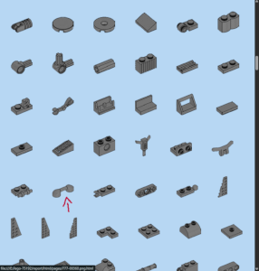
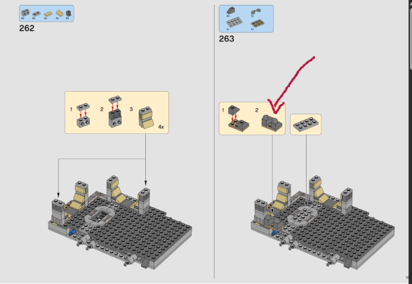

# Lego Finder

Lego Finder to locate instruction page for given brick.

## Why

Imagine you moved between flats. Among the boxes you have a huge one, labeled "Millennium Falcon". You unpack the pieces you broke the model into and rebuild the model. And then you see a bunch of bricks and small components on the bottom of the box. :worried:


No worries, there must be an online service, that will help w... :worried:

Ok, all you have to do is get the PDF from Lego or one of the services you found in previous step, extract all the pages as series of PNG images, find all the bill of material boxes, find the bricks in those boxes, group similar bricks together, generate a usage report and hope for the best.

## Usage

This is exactly the aim of this project. Let's say, you have 75912 set instruction PDF booklet. With ImageMagick, this PDF can be extracted to series of PNG images with, for instance

```shell
magick -verbose \
    -density 596 \
    6564020.pdf \
    -background white \
    -alpha background \
    -alpha off \
    page-%03d.png
```

Out of the produced set of images, the actual instructions can be copied to separate directory. For instance, in case of 75912, it would be files from `page-019.png` to `page-459.png`, inclusive.

With those files set aside, check the color of the BoM boxes and then generate the report with

```sh
lego instructions/ -o report/ -c b7d7f3
```

From there, you can lookup the brick image and click on it to get the images of all the pages this brick is on.

## Results

Luckily, the blocks found on the bottom of the cardboard box had a very specific shape. Similarly, this particular use is mentioned on the very first page this brick was found on.




Some other found additional pieces were less lucky. Still I personally was able to put back 60% of found parts, including fixing a mistake I did back when I originally assembled the model 4 years ago. It also allowed for things, like making sure all expected uses of a particular tiny brick are in fact present on the model and the brick in hand is part of spare parts.

## Building

### Prerequisites

To configure the project:

- [Python 3.12](https://www.python.org/) to run all the tools and scripts, including `./flow`.
- [Conan 2](https://conan.io/) to get all the dependencies.
- [CMake 3.28](https://cmake.org/) to configure the build and to pack the binaries.

To build the project:

- On Windows, Visual Studio 2022.
- On Linux, GCC 13 and [Ninja 1.11](https://ninja-build.org/).

Each of the commands below can substitute `--rel` parameter with `--dbg` to build a debug build.

### Configuration

Run the command below to recreate `build/conan` and `build/release` directories.

```sh
./flow config --rel
```

### Compilation

Run the command below to build the command line tool under `./build/release/bin/lego`.

```sh
./flow build --rel
```
